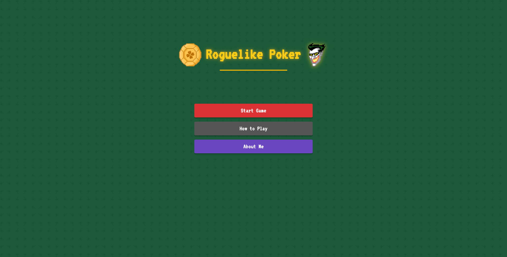
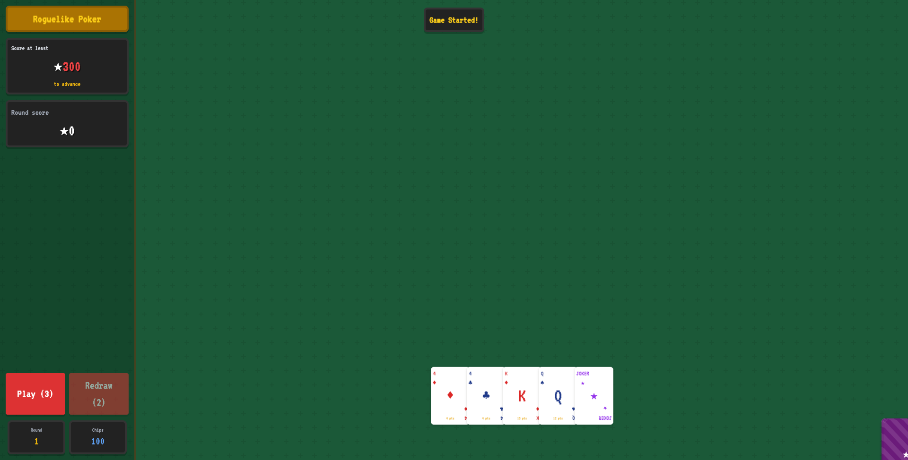
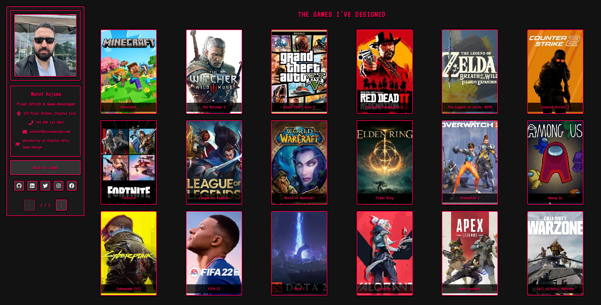

# Roguelike Poker

This is a portfolio website made for game developers and game designers, inspired by the Balatro game.

## Description

Roguelike Poker is a turn-based card game where you play poker hands to earn points. Each round has a target score you must reach to advance, with limited plays (antes) available. As you progress, you'll earn chips to buy special joker cards that provide powerful multipliers and effects.

## Screenshots

### Main Menu



### Gameplay



### About Page



## Game Features

- **Poker-Based Gameplay**: Play traditional poker hands (Pairs, Three of a Kind, Straights, Flushes)
- **Roguelike Progression**: Increasing difficulty with each round
- **Deck Building**: Collect jokers and upgrades to enhance your scoring potential
- **Shop System**: Spend chips to acquire powerful jokers between rounds
- **Balatro-Inspired UI**: Vibrant, retro-style interface with satisfying animations

## How to Play

1. **Start a Game**: Click "Start Game" on the main screen
2. **Select Cards**: Click on up to 3 cards from your hand
3. **Play Cards**: Click "Play" to submit your selection (uses 1 ante)
4. **Redraw**: Click "Redraw" to replace selected cards (limited uses)
5. **Score Points**: Form poker hands to score points (higher hands score more)
6. **Reach Target**: Score enough points to reach the round's target
7. **Buy Upgrades**: Visit the shop between rounds to spend chips on jokers
8. **Advance**: Progress through increasingly difficult rounds

## Scoring System

- **Pair**: 200 points
- **Three of a Kind**: 400 points
- **Straight**: 600 points
- **Flush**: 800 points
- **High Card**: Sum of card values

Jokers apply multipliers to these base scores!

## Technologies Used

- React.js
- TypeScript
- React Router
- Tailwind CSS
- Lucide React (icons)
- Vite (build tool)

## Development

### Prerequisites

- Node.js (v14 or higher)
- npm or yarn

### Installation

```bash
# Clone the repository
git clone https://github.com/yourusername/roguelike-poker.git

# Navigate to the project directory
cd roguelike-poker

# Install dependencies
npm install
```

### Running the Development Server

```bash
npm run dev
```

This will start the development server at `http://localhost:5173/`.

### Building for Production

```bash
npm run build
```

## Project Structure

- `src/components/`: React components for game elements
- `src/data/`: Game data and configurations
- `src/styles/`: CSS styles including pixel art effects
- `src/types/`: TypeScript type definitions
- `public/`: Static assets and images

## License

MIT

## Acknowledgements

- Inspired by the game [Balatro](https://www.playbalatro.com/)
- Card game mechanics based on traditional poker
- Pixel art styling for a retro gaming experience
